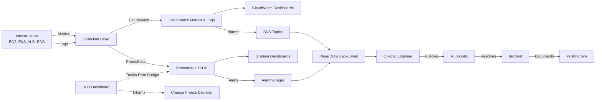

# Monitoring & Observability Stack

Production-grade monitoring and observability configuration for AWS infrastructure, demonstrating end-to-end visibility from metrics collection through incident response.

## Observability Pipeline



## Quick Review for Hiring Managers

**60-second path to understand this repository:**

1. **Monitoring Philosophy** → [`docs/ARCHITECTURE.md`](docs/ARCHITECTURE.md) — see the full observability design
2. **Alert Design** → [`alerting/escalation-policy.md`](alerting/escalation-policy.md) — P1-P4 severity model
3. **Incident Response** → [`runbooks/POD-CRASHLOOP.md`](runbooks/POD-CRASHLOOP.md) — example runbook with specific commands
4. **SRE Maturity** → [`slo/SLO-DEFINITIONS.md`](slo/SLO-DEFINITIONS.md) — SLO targets and error budgets
5. **Infrastructure as Code** → [`terraform/cloudwatch/alarms.tf`](terraform/cloudwatch/alarms.tf) — production-ready alarm definitions

## What This Proves

### Monitoring Design
- **Dual-stack approach**: CloudWatch for AWS-native services, Prometheus/Grafana for Kubernetes workloads
- **Multi-layer coverage**: Infrastructure metrics (CPU, memory, disk) + application metrics (request rate, errors, latency)
- **Composite alarms**: Combining signals to reduce alert noise and identify systemic issues

### Alerting Philosophy
- **Severity-based routing**: Critical alerts page on-call immediately, warnings go to Slack, info to email digest
- **Runbook-driven response**: Every alert links to specific investigation and remediation steps
- **Inhibition rules**: Prevent cascading alerts when root cause is already known

### SLO Thinking
- **User-centric objectives**: 99.9% availability and p99 latency targets based on customer impact
- **Error budget management**: Defined policies for when to slow deployments or freeze changes
- **Burn rate tracking**: Multi-window detection to catch incidents before SLO breach

### Incident Response Integration
- **Runbooks with actual commands**: Not "check the logs" — specific `kubectl`, `aws cli`, and CloudWatch Logs Insights queries
- **Escalation paths**: Clear guidance on when to escalate and to whom
- **Postmortem linkage**: Runbooks reference the ops-runbooks repo for incident documentation templates

## Stack Options

This repository demonstrates flexibility across monitoring stacks:

| Component | CloudWatch Path | Prometheus/Grafana Path |
|-----------|-----------------|-------------------------|
| **Metrics Collection** | CloudWatch Agent, Container Insights | Prometheus with Kubernetes service discovery |
| **Storage** | CloudWatch Metrics | Prometheus TSDB (with Thanos for long-term) |
| **Visualization** | CloudWatch Dashboards | Grafana with provisioned dashboards |
| **Alerting** | CloudWatch Alarms → SNS | Prometheus Alerting Rules → Alertmanager |
| **Notification** | SNS → PagerDuty/Slack/Email | Alertmanager → PagerDuty/Slack/Email |

Both approaches are production-ready. The choice depends on organizational standards, existing tooling, and cost considerations (detailed in [`docs/DECISION-LOG.md`](docs/DECISION-LOG.md)).

## Repository Structure

```
au-nz-observability-stack/
├── terraform/
│   ├── cloudwatch/          # CloudWatch dashboards, alarms, log groups, metric filters
│   └── sns/                 # SNS topics for alarm routing
├── prometheus/              # Prometheus config, alert rules, recording rules
├── grafana/                 # Grafana dashboards (JSON) and datasource provisioning
├── alerting/                # Escalation policies, Alertmanager config, alert routing docs
├── runbooks/                # Step-by-step incident response guides
├── slo/                     # SLO definitions, error budget policy, burn rate dashboard
├── docs/                    # Architecture diagrams, decision log, cost estimates, maturity model
└── .github/workflows/       # CI validation (terraform fmt, YAML lint, JSON lint)
```

## Deployment

### CloudWatch Stack

```bash
git clone https://github.com/justin-henson/au-nz-observability-stack.git
cd au-nz-observability-stack/terraform/sns
terraform init
terraform plan -var="environment=production"
terraform apply

cd ../cloudwatch
terraform init
terraform plan -var="environment=production" -var="sns_topic_arn=<from-sns-output>"
terraform apply
```

### Prometheus + Grafana on EKS

Requires an existing EKS cluster (see [au-nz-k8s-baseline-eks](https://github.com/justin-henson/au-nz-k8s-baseline-eks)):

```bash
# Deploy Prometheus with Helm
helm repo add prometheus-community https://prometheus-community.github.io/helm-charts
helm repo update

helm install prometheus prometheus-community/kube-prometheus-stack \
  --namespace monitoring \
  --create-namespace \
  --values prometheus/helm-values.yml

# Apply custom alert rules
kubectl apply -f prometheus/alert-rules.yml

# Configure Grafana datasources and dashboards
kubectl apply -f grafana/provisioning/
```

See [`prometheus/README.md`](prometheus/README.md) and [`grafana/README.md`](grafana/README.md) for detailed deployment instructions.

## Connects To

This observability stack integrates with the full portfolio infrastructure:

- [**au-nz-cloud-baseline-aws**](https://github.com/justin-henson/au-nz-cloud-baseline-aws) — this stack monitors THAT infrastructure (VPC, EC2, ALB, RDS)
- [**au-nz-k8s-baseline-eks**](https://github.com/justin-henson/au-nz-k8s-baseline-eks) — Prometheus and Grafana run ON that cluster
- [**au-nz-cicd-pipeline**](https://github.com/justin-henson/au-nz-cicd-pipeline) — monitoring config deployed THROUGH that pipeline
- [**au-nz-ops-runbooks**](https://github.com/justin-henson/au-nz-ops-runbooks) — runbooks HERE extend the operational templates THERE

## Key Features

### Comprehensive Alert Coverage
- **Infrastructure**: CPU, memory, disk, network, status checks
- **Application**: Request rate, error rate, latency (RED method)
- **AWS Services**: ALB target health, RDS resource exhaustion, EKS node status
- **Certificates**: TLS certificate expiry warnings (30-day, 7-day)

### Dashboard Design
- **Infrastructure Overview**: System resource utilization across all instances
- **Application Health**: RED method panels for request-driven services
- **Kubernetes Cluster**: Pod lifecycle, resource quotas, HPA scaling activity
- **Cost Overview**: AWS spend trends and budget tracking
- **SLO Dashboard**: Error budget burn rate with multi-window detection

### Runbook Quality
Each runbook includes:
- **Impact statement**: What users experience during this incident
- **Investigation steps**: Specific commands to diagnose root cause
- **Remediation actions**: Ordered by likelihood, with rollback procedures
- **Escalation criteria**: When to page senior engineers or vendors
- **Postmortem link**: Template for documenting lessons learned

## Observability Maturity

This setup represents **Level 3: Proactive Monitoring** on a 4-level maturity model:

- ✅ Infrastructure and application metrics with SLO tracking
- ✅ Runbook-driven incident response with escalation policies
- ✅ Error budget management influencing deployment decisions
- 🔲 Distributed tracing (next step: OpenTelemetry)
- 🔲 Log correlation across services
- 🔲 AIOps and predictive alerting

See [`docs/OBSERVABILITY-MATURITY.md`](docs/OBSERVABILITY-MATURITY.md) for the full maturity model and roadmap to Level 4.

## Validation

All configuration files are validated in CI:

```bash
# Terraform
terraform fmt -check -recursive
terraform init && terraform validate

# YAML
yamllint -c .yamllint.yml .

# Grafana dashboards
find grafana/dashboards -name "*.json" -exec python3 -m json.tool {} \; > /dev/null
```

See [`.github/workflows/validate.yml`](.github/workflows/validate.yml) for the complete validation pipeline.

## License

MIT License — see [LICENSE](LICENSE) file.

---

*Built with ☕ for AU/NZ DevOps opportunities*
