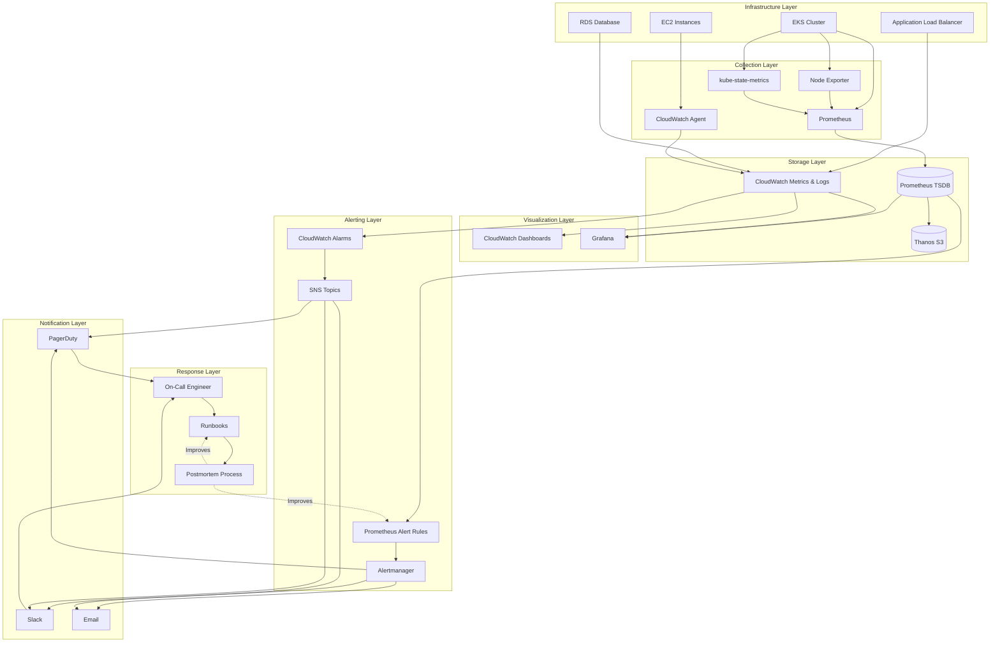

# Observability Stack Architecture

This document describes the complete observability pipeline from metrics collection through incident response.

## Architecture Diagram



## Data Flow

### Metrics Collection

**CloudWatch Path**:
1. EC2/RDS/ALB emit native metrics to CloudWatch (1-min intervals)
2. CloudWatch Agent collects custom application metrics
3. Metrics stored in CloudWatch Metrics (15-month retention)
4. Available for dashboards, alarms, and Grafana queries

**Prometheus Path**:
1. Application instruments code with Prometheus client library
2. Prometheus scrapes `/metrics` endpoints every 15 seconds
3. Node Exporter exposes system metrics (CPU, memory, disk, network)
4. kube-state-metrics exposes Kubernetes object state
5. Metrics stored in Prometheus TSDB (30-day retention)
6. Thanos sidecar copies to S3 for long-term storage

### Logs Collection

1. Applications write structured JSON logs to stdout/stderr
2. Container runtime captures logs
3. Logs shipped to CloudWatch Logs (30-day retention)
4. Log metric filters extract custom metrics from logs
5. Logs searchable via CloudWatch Logs Insights or external SIEM

### Alert Processing

**Prometheus Alerts**:
1. Alert rules evaluate every 15 seconds
2. When expression true for `for` duration, alert fires
3. Alert sent to Alertmanager
4. Alertmanager groups, deduplicates, routes based on labels
5. Inhibition rules suppress redundant alerts
6. Notification sent to receiver (PagerDuty, Slack, email)

**CloudWatch Alarms**:
1. Alarm evaluates metric every 1 minute
2. When threshold breached for evaluation periods, state changes to ALARM
3. Alarm action triggers SNS topic
4. SNS delivers to subscribed endpoints (HTTPS, email, Lambda)

## Component Details

### Prometheus

**Purpose**: Time-series metrics collection and alerting for Kubernetes workloads

**Deployment**: Runs in `monitoring` namespace via kube-prometheus-stack Helm chart

**Configuration**:
- Scrape interval: 15s
- Retention: 30 days local, unlimited via Thanos
- Alert evaluation: 15s

**Service Discovery**: Automatically discovers:
- Kubernetes pods (via annotation `prometheus.io/scrape: "true"`)
- Kubernetes services
- Nodes and API server

### Alertmanager

**Purpose**: Alert routing, grouping, and notification delivery for Prometheus alerts

**Deployment**: 3 replicas in `monitoring` namespace for high availability

**Routing Strategy**:
- Critical alerts → PagerDuty (immediate)
- Warning alerts → Slack (within hours)
- Info alerts → Email digest (daily)

**Grouping**: By alertname, namespace, service (reduces noise during incidents)

### Grafana

**Purpose**: Unified visualization layer for Prometheus and CloudWatch metrics

**Deployment**: Single instance with persistent storage (10GB)

**Datasources**:
- Prometheus (default, http://prometheus-operated:9090)
- CloudWatch (IRSA for cross-account access)

**Dashboards**: Provisioned from Git via ConfigMaps

### CloudWatch

**Purpose**: AWS-native monitoring for EC2, ALB, RDS, and custom metrics

**Metrics**: 5-minute (free tier) and 1-minute (detailed monitoring) intervals

**Alarms**: Directly integrated with SNS for notification delivery

**Advantages**:
- Zero setup for AWS services
- Integrated with AWS Auto Scaling and Health Checks
- No infrastructure to maintain

### Thanos

**Purpose**: Long-term storage and global query view for Prometheus

**Components**:
- **Sidecar**: Uploads Prometheus blocks to S3 every 2 hours
- **Store Gateway**: Queries historical data from S3
- **Compactor**: Downsamples and compacts old data for efficiency

**Retention**: Unlimited (S3 storage cost only)

## High Availability

### Prometheus HA

- Deployed with 2 replicas scraping identical targets
- Both write to same S3 bucket via Thanos
- Alertmanager deduplicates alerts from multiple Prometheus instances

### Alertmanager HA

- 3 replicas in active-active cluster
- Gossip protocol for alert deduplication
- Any replica can accept alerts and route notifications

### Grafana HA (Optional)

- Single instance sufficient for visualization
- For HA: Deploy 2+ instances with shared Postgres backend
- Use ALB/Ingress for load balancing

## Security

### Authentication

- **Grafana**: OAuth integration with corporate SSO
- **Prometheus**: Behind ingress with OAuth2 proxy
- **Alertmanager**: Same OAuth2 proxy as Prometheus

### Authorization

- **Kubernetes RBAC**: Prometheus ServiceAccount has read-only access to metrics endpoints
- **AWS IAM**: Grafana uses IRSA for CloudWatch read access
- **Network Policies**: Restrict metrics scraping to monitoring namespace

### Data Privacy

- **Metrics**: No PII in metric labels (use hashed identifiers)
- **Logs**: PII scrubbed before shipping to CloudWatch
- **Retention**: GDPR-compliant retention (30 days active, 90 days archive)

## Scalability

### Prometheus Scaling

**Vertical**: Increase memory/CPU for higher cardinality or scrape frequency
- Current: 4GB RAM, 2 vCPU
- Scales to: 16GB RAM, 4 vCPU

**Horizontal**: Shard scraping across multiple Prometheus instances
- Use Thanos Query for unified querying
- Separate Prometheus per namespace or team

### CloudWatch Scaling

- AWS-managed, scales automatically
- No infrastructure changes required
- Cost scales linearly with metric volume

### Alert Volume

- Alertmanager handles 10,000+ alerts/sec
- Grouping and inhibition reduce notification volume by 90%+
- Rate limiting prevents notification storms

## Disaster Recovery

### Metrics Loss

**Prometheus**:
- Local TSDB: Recover from Thanos S3 (RPO: 2 hours)
- Complete cluster loss: Redeploy and restore from S3 (RTO: 30 minutes)

**CloudWatch**:
- AWS-managed, built-in redundancy
- Metrics available across multiple AZs

### Alert Configuration Loss

- All configuration in Git (Infrastructure as Code)
- Redeploy from Git takes <5 minutes
- Alertmanager silences persisted to volume (survives pod restart)

## Cost Optimization

### Prometheus

- Use recording rules to pre-compute expensive queries
- Downsample old data via Thanos Compactor (5m → 1h → 1d)
- Set appropriate retention (30d local, 1y S3)

### CloudWatch

- Use custom metrics sparingly (billed per metric-month)
- Leverage CloudWatch Logs Insights instead of exporting all logs
- Use basic monitoring (5-min) where detailed monitoring not needed

### Grafana

- Use Prometheus for high-cardinality queries (cheaper than CloudWatch)
- Cache dashboard queries (1-minute refresh sufficient for most views)
- Limit CloudWatch API calls with longer query intervals

## Monitoring the Monitoring

### Meta-Alerts

- AlertmanagerDown: Alertmanager pod not reachable
- PrometheusDown: Prometheus not scraping targets
- PrometheusRuleFailure: Alert rule evaluation errors
- PrometheusTSDBCompaction: TSDB compaction failing

### Health Checks

```bash
# Prometheus health
curl http://prometheus:9090/-/healthy

# Alertmanager health
curl http://alertmanager:9093/-/healthy

# Grafana health
curl http://grafana/api/health
```

## Future Enhancements

1. **Distributed Tracing**: Add Jaeger/Tempo for request tracing
2. **Log Aggregation**: ELK/Loki stack for centralized log search
3. **Synthetic Monitoring**: Blackbox exporter for external endpoint checks
4. **AIOps**: Anomaly detection and predictive alerting
5. **Service Mesh**: Istio/Linkerd for automatic service-level metrics

---

## References

- [Prometheus Documentation](https://prometheus.io/docs/)
- [Thanos Documentation](https://thanos.io/tip/thanos/design.md/)
- [CloudWatch User Guide](https://docs.aws.amazon.com/AmazonCloudWatch/latest/monitoring/)
- [Grafana Documentation](https://grafana.com/docs/)
